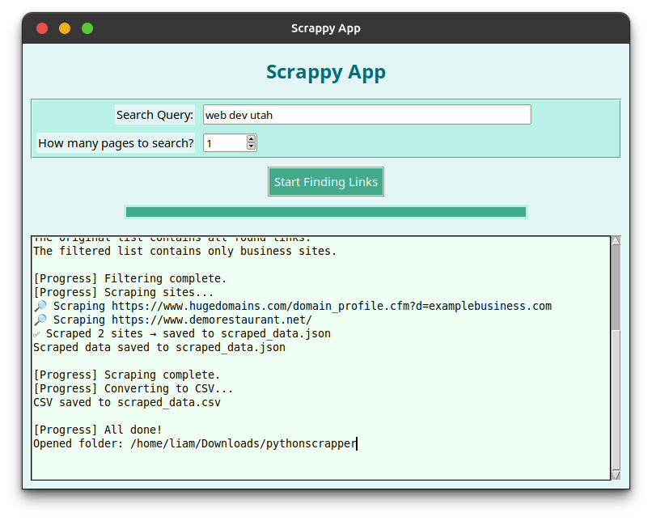

# Scrappy App (Sanitized Demo)

Scrappy App is a **Python desktop application** that demonstrates a full pipeline for discovering, filtering, and scraping websites wrapped in a simple Tkinter GUI.

This repository is a **sanitized version** of a larger private project. Sensitive functionality (such as email/phone extraction or Google scraping automation) has been removed to ensure responsible use. The goal is to showcase **software design, GUI development, and data workflow skills**.

---

## ✨ Features

* **Search Interface** – Enter a query and number of pages to simulate finding websites.
* **Link Filtering** – Keeps only business-like sites, removing noise.
* **Scraper (Sanitized)** – Collects safe metadata such as site titles and basic structure.
* **Technology Detection** – Attempts to identify frameworks/CMS (e.g., WordPress, Shopify, Next.js).
* **Data Export** – Results saved as both JSON and CSV for further analysis.
* **Tkinter GUI** – User-friendly interface to manage the workflow end-to-end.

---

## 🖼️ Screenshot

---

## ⚙️ Tech Stack

* **Python 3**
* **Tkinter** (GUI)
* **BeautifulSoup4** (HTML parsing)
* **Requests** (HTTP requests)
* **JSON & CSV** (data export)

---

## 📂 Project Structure

* `app.py` → Tkinter GUI controller
* `linkfilter.py` → Filtering logic for keeping business sites
* `scrapper.py` → Scraper (emails/phones replaced with placeholders)
* `linkfinder.py` → Demo link finder (returns safe example links)
* `app.png` → Screenshot of the GUI

---

## ⚠️ Disclaimer

This project is for **educational and portfolio purposes only**.
Sensitive scraping logic has been **removed or sanitized** to prevent misuse.
All rights reserved. You may view the code, but you may not use, copy, modify, or redistribute it in any form. This restriction is intended to prevent misuse.
